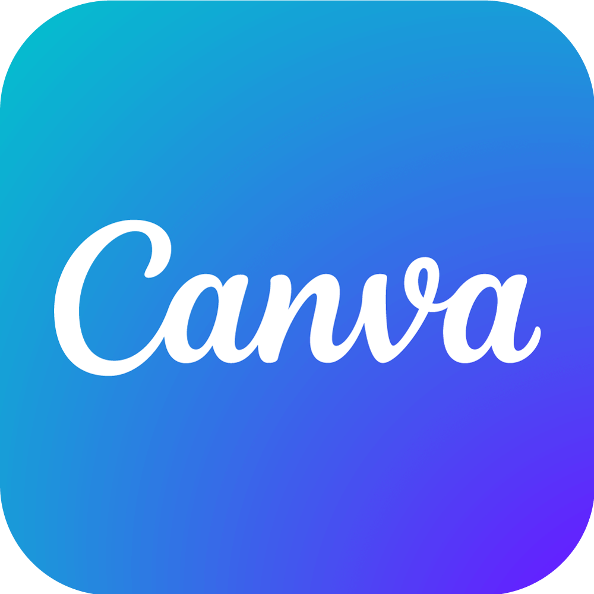

<h1 align="center">Hi there! I'm Diego 👋</h1>

  

  <strong>🇧🇷 Olá | 🇺🇸 Hello</strong>

  Desenvolvedor Mobile em formação, com paixão por código limpo, interfaces criativas e soluções com propósito.  
  Curioso por natureza, sempre buscando unir tecnologia, design e impacto social.

## Sobre mim:

- **Bacharelando em Ciência da Computação** – UTFPR.  
- Pesquisador e Desenvolvedor **Flutter** da Rede Campo – Pesquisa Inovação e Extensão em Desenvolvimento Rural.  
- Apaixonado por projetos com impacto real e foco em usabilidade.  
- Especialista em interfaces intuitivas, acessíveis e responsivas, com atenção aos detalhes de UI e UX.  
- Em constante evolução: iniciando meus estudos em **React, explorando integrações com APIs e design systems**.  

## Tech Stack

  
  
  
  
  
  

## GitHub Insights

  

## Vamos conversar?

  
  

---
> *"Transformando boas ideias em soluções reais, uma linha de código por vez."* — Diego Lucas
